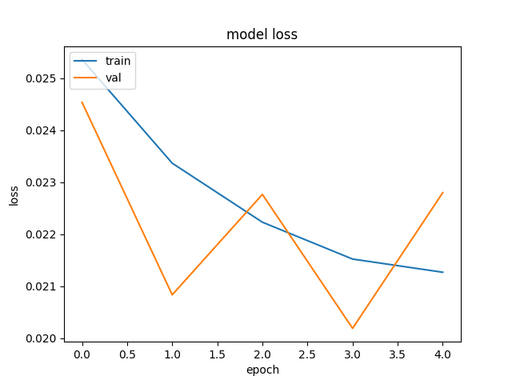

##Introduction
This is the Behaviour Cloning project Udacity's Self Driving Nanodegree program. 
I have explained below my process of behaviour cloning to train the car to drive around a simulated track.

##Collection of Data
Data was collected by combining the training data received from Udacity and by using the Simulator. 
In Simulator's Training mode, I drove the car couple of laps around the track to record proper driving data. 
I also needed recovery data for training since just the correct driving data was not sufficient. This recovery data
is needed to let the model know what to do when it goes away from the track. I drove the car to the side of the track
and only recorded the data where it would correct itself to come back to the center of the track. This was done 
wherever the model needed more training, especially at tight corners. 
I also used the left and right images from Udacity's training set and altered the steering angles for them. 
For example, if I train the model to associate a given image from the center camera with a left turn, then I could also train the model to associate the corresponding image from the left camera with a somewhat softer left turn. And I could train the model to associate the corresponding image from the right camera with an even harder left turn.

##Pre-processing the data
Pre-processing the data was very important since there is a lot of unwanted noise in the data. We want to focus only
on the track. So I trimmed the data of the background and converted the image to thresholded grayscale image so 
that it is easy and faster for the model to train rather than training on raw color image.
Below is the pipeline I used: 
1. Trim Image 
2. Threshold Image 
3. Grayscale Image 
4. Normalize Image 
5. Resize Image 
 

 

 

 

 

 

 

All preprocessing functions are defined in img_utils.py

##Creating Validation Set
The training data has been shuffled and then split to training and validation set with 80-20 split respectively. 
Test set is not needed for this project since the simulator in autonomous mode itself will act as the test set. 

##Model Architecture
###CNN Layers
I used a modified Nvidia model for my training. Below are the layers in my model: 
1. Convolution Layer 1 
2. MaxPooling 
3. Convolution Layer 2 
4. Dropout 
5. Convolution Layer 3 
6. Dropout 
7. Flatten 
8. Fully Connected Layer 1 
9. Fully Connected Layer 2 
10. Fully Connected Layer 3 
11. Fully Connected Layer 4 
Activation is added to each convolution and fully connected layers.

###Model parameters
Optimizer = Adam 
Batch Size = 128 
Epochs = 5 
I used Adam optimizer for my model. I also trained the model by using generator to save memory.
This ensured that only images in one batch is being processed at a time.
Batch size selected was 128. I started with epochs as 10 but realized didn't gain much improvement
in training in the later epochs. So narrowed it down to 5 which was sufficient for a good validation loss

##Results
Training took around 2 mins for each epoch. Below is the graph for training loss/validation loss vs epoch  

I however did not have successful testing of my model. I am not sure what is causing this. I collected all recovery data too, but for some reason my car does not seem to correcting itself at all the corners properly. When I train it at one corner, I see a new error in another corner where it previously drove correctly. 
I have spent way too many hours on this project and wanted to check it in with the results I have so far. Any help to improve my model or training set is greatly appreciated.
