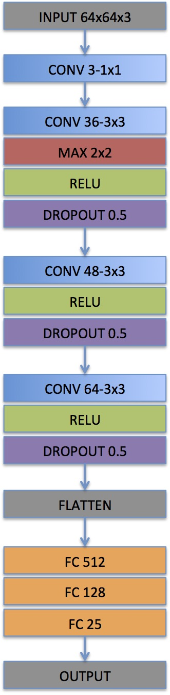

##Introduction
This is the Behaviour Cloning project Udacity's Self Driving Nanodegree program. 
I have explained below my process of behaviour cloning to train the car to drive around a simulated track.

##Collection of Data
Data was collected by combining the training data received from Udacity and by using the Simulator. 
In Simulator's Training mode, I drove the car couple of laps around the track to record proper driving data. 
I also needed recovery data for training since just the correct driving data was not sufficient. This recovery data
is needed to let the model know what to do when it goes away from the track. I drove the car to the side of the track
and only recorded the data where it would correct itself to come back to the center of the track. This was done 
wherever the model needed more training, especially at tight corners.<BR>
I also used the left and right images from Udacity's training set and altered the steering angles for them. 
For example, if I train the model to associate a given image from the center camera with a left turn, then I could also train the model to associate the corresponding image from the left camera with a somewhat softer left turn. And I could train the model to associate the corresponding image from the right camera with an even harder left turn.


##Pre-processing the data
Pre-processing the data was very important since there is a lot of unwanted noise in the data. We want to focus only
on the track. So I trimmed the data of the background and converted the image to thresholded grayscale image so 
that it is easy and faster for the model to train rather than training on raw color image.
Below is the pipeline I used:<BR>
1. Trim Image<BR>
2. Threshold Image<BR>
3. Grayscale Image<BR>
4. Normalize Image<BR>
5. Resize Image<BR>
<BR>

<BR>

<BR>

<BR>

<BR>

<BR>

<BR>

All preprocessing functions are defined in img_utils.py

##Creating Validation Set
The training data has been shuffled and then split to training and validation set with 80-20 split respectively. 
Test set is not needed for this project since the simulator in autonomous mode itself will act as the test set. 

##Model Architecture
###CNN Layers
I directly started off first with NVIDIA model, but found that for the initial dataset, car just wouldn't stay on track. Even after augmenting and preprocessing data, the model just wouldn't work. I needed a slightly simpler model. <br> 
So I followed David's QnA video on youtube for this project and started of by initially adding just one convolution layer and one fully connected layer, and kept increasing the layers and experimenting with them until I got good results. Finally I settled with below architecture.<br>

* Input is color image of 64x64 shape.
* Initial convolution layer has 3 filters of 1x1, this is done to select the best color pixel from the input image.
* This succeeds with 3 sets of convolution layers, each with an activation layer and a dropout layer.
* Maxpooling was used in the first set of layers immediately after convolution layer to get rid of pixels that are not dominating.
* Non-linearity is introduced by using RELU as activation layer. This ensure better fit.
* To avoid overfitting, regularization is used by adding a Dropout layer in each set.
* After the three sets, the layer is flattened.
* Finally 3 fully connected layers are used to arrive at the final output of just one node which is the steering angle.

I also noticed that, if I added just one more convolution layer or FC layer, car started to wobble too much. So I believe for my data set this model seems to work pretty good.



###Model parameters
Optimizer = Adam<BR>
Batch Size = 128<BR>
Epochs = 5<BR>
I used Adam optimizer for my model. I also trained the model by using generator to save memory.
This ensured that only images in one batch is being processed at a time.
Batch size selected was 128. I started with epochs as 10 but realized didn't gain much improvement
in training in the later epochs. So narrowed it down to 5 which was sufficient for a good validation loss

##Training the Model
In order to train using my model, run below command:
```
$python model.py
```

This will generate two files, model_best.json and model_best.h5
(For simplicity I have renamed these files and remove '_best' suffix in this repo.)

##Results
Training took around 2 mins for each epoch. Below is the graph for training loss/validation loss vs epoch <BR>
As seen in the graph, validation loss keeps varying in between epochs. That is why I generate model_best.json and model_best.h5 that stores the values corresponding to the best epoch in case the last one is not the best.


##Running the Simulator for Test
In order to test the model in the simulator, run below command:
```
$python drive.py model.json
```
